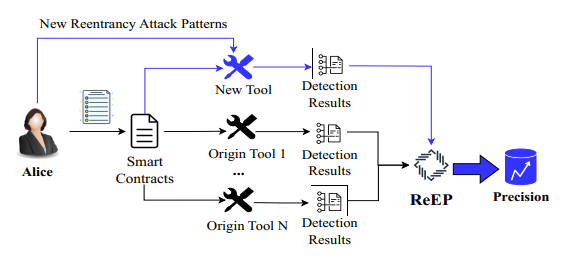
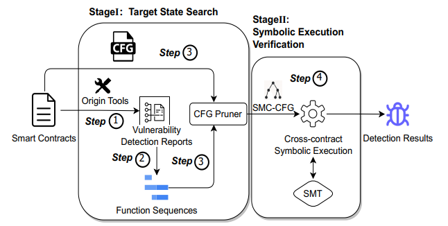

# ReEP

## Description

A tool named ReEP, designed to reduce the false positives in current Reentrancy detection tools.

## Use Cases

Alice, a smart contract developer, faces challenges in assessing Reentrancy vulnerabilities using various detection tools. These tools often report different locations, leading to manual verification. The high false positive rates of existing tools, up to 99.8%, further increase her workload. 

<p align="center">
  
</p>

To address this, Alice adopts ReEP, an automated verification tool. ReEP evaluates results from multiple tools, reducing false positives and enhancing precision. Its extensibility allows seamless integration of new tools for emerging attack patterns, ensuring comprehensive coverage. ReEP significantly reduces manual verification, making it practical for large-scale smart contract detection tasks.

## Overview
The design refers to the architecture shown below:

<p align="center">
  
</p>

## Code Structure

- `analyzer`: The **_analyzer_** module compiles the source code of Solidity smart contracts and extracts useful information for further analysis before symbolic execution.
- `binary`: The **_binary_** module is responsible for processing binary characters.
- `core`: The **_core_** module handles the main program for symbolic execution.
- `defector`: The **_defector_** module is a complex strategy module for major vulnerability detection.
- `ethereum`: The **_ethereum_** module provides components for EVM operations and semantic interpretation.
- `examples`: The **_examples_** directory contains the demonstration example for running ReEP.
- `executor`: The **_executor_** module ensures the correct execution of each component.
- `native`: The **_native_** module deals with memory access and computation during symbolic execution.
- `utils`: The **_utils_** module is a utility component library.
- `install.sh`: Bash script for the automated installation of ReEP.
- `ReEP.py`: Interfaces for input and output.
- `requirements.txt`: Required packages for running the tool.

## Usage

Run ```python3 ReEP.py --help``` for a list of options.

```
RRRRRRRRRRRRRRRRR                     EEEEEEEEEEEEEEEEEEEEEEPPPPPPPPPPPPPPPPP   
R::::::::::::::::R                    E::::::::::::::::::::EP::::::::::::::::P  
R::::::RRRRRR:::::R                   E::::::::::::::::::::EP::::::PPPPPP:::::P 
RR:::::R     R:::::R                  EE::::::EEEEEEEEE::::EPP:::::P     P:::::P
  R::::R     R:::::R    eeeeeeeeeeee    E:::::E       EEEEEE  P::::P     P:::::P
  R::::R     R:::::R  ee::::::::::::ee  E:::::E               P::::P     P:::::P
  R::::RRRRRR:::::R  e::::::eeeee:::::eeE::::::EEEEEEEEEE     P::::PPPPPP:::::P 
  R:::::::::::::RR  e::::::e     e:::::eE:::::::::::::::E     P:::::::::::::PP  
  R::::RRRRRR:::::R e:::::::eeeee::::::eE:::::::::::::::E     P::::PPPPPPPPP    
  R::::R     R:::::Re:::::::::::::::::e E::::::EEEEEEEEEE     P::::P            
  R::::R     R:::::Re::::::eeeeeeeeeee  E:::::E               P::::P            
  R::::R     R:::::Re:::::::e           E:::::E       EEEEEE  P::::P            
RR:::::R     R:::::Re::::::::e        EE::::::EEEEEEEE:::::EPP::::::PP          
R::::::R     R:::::R e::::::::eeeeeeeeE::::::::::::::::::::EP::::::::P          
R::::::R     R:::::R  ee:::::::::::::eE::::::::::::::::::::EP::::::::P          
RRRRRRRR     RRRRRRR    eeeeeeeeeeeeeeEEEEEEEEEEEEEEEEEEEEEEPPPPPPPPPP           

usage: ReEP.py [-h] [-a] [-r] [-f FILE] [-o OUTPUT] [-c CONTRACT] [-func FUNCTION]

optional arguments:
  -h, --help            show this help message and exit
  -f FILE, --file FILE  path to the input file
  -o OUTPUT, --output OUTPUT
                        path to the output file
  -c CONTRACT, --contract CONTRACT
                        contract name
  -func FUNCTION, --function FUNCTION
                        function name

Analysis options:
  -a, --analyze         Search for vulnerability information

Vulnerability options:
  -r, --reentrancy      Check for reentrancy vulnerabilities
```

```
# The -o option sets the storage location of the output results, the default value is output.txt
# The -r option supports Reentrancy vulnerability detection

# Verification of detection tool results
python ReEP.py -f <filename> -c <contract filename> -func <function name> -r 
python ReEP.py -f examples/0x96edbe868531bd23a6c05e9d0c424ea64fb1b78b.sol -c 'PENNY_BY_PENNY' -func 'Collect(uint256)' -r 

# Use the -a option to locate vulnerabilities (including contract names and function names)
python ReEP.py -f <filename> -r -a
python ReEP.py -f examples/0x96edbe868531bd23a6c05e9d0c424ea64fb1b78b.sol -r -a


```


## Dependencies Installation

### [virtualenv](https://virtualenvwrapper.readthedocs.io/en/latest/) to configure the python environment.

```
$ pip3 install virtualenvwrapper
$ source /usr/local/bin/virtualenvwrapper.sh
$ mkvirtualenv --python=`which python3.8` python38
```

### solc-select
```
$ pip3 install solc-select
```

### [z3](https://github.com/Z3Prover/z3/releases) Theorem Prover version 4.5.0.

Download the [source code of version z3-4.5.0](https://github.com/Z3Prover/z3/releases/tag/z3-4.5.0)

Install z3 using Python bindings

```
$ python3 scripts/mk_make.py --python
$ cd build
$ make
$ sudo make install
```


### tool installation
Run the script to install the tools:
```
$ bash install.sh
```
